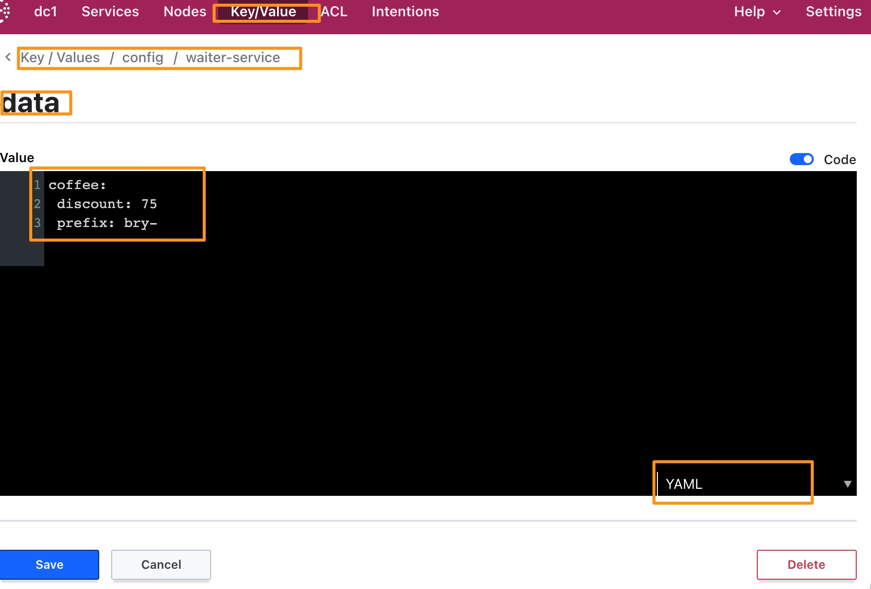

# Config Server 相关Demo

要新建一个Spring boot 项目 作为 Config Server

## pom
加上 discovery 注册到服务发现，其他服务就可以通过服务名找到了
加上 spring-cloud-config-server
```xml
<dependency>
    <groupId>org.springframework.boot</groupId>
    <artifactId>spring-boot-starter-web</artifactId>
</dependency>
<dependency>
    <groupId>org.springframework.cloud</groupId>
    <artifactId>spring-cloud-config-server</artifactId>
</dependency>
<dependency>
    <groupId>org.springframework.cloud</groupId>
    <artifactId>spring-cloud-starter-consul-discovery</artifactId>
</dependency>
<dependency>
    <groupId>org.springframework.boot</groupId>
    <artifactId>spring-boot-starter-actuator</artifactId>
</dependency>
```
## 配置
* 这边选用consul相关配置，做相关配置
* 配置作为配置的git 的目录，可以选用本地目录做测试  
* 远端也是一样，建个repo就好
```properties
server.port=8888
spring.application.name=configserver

management.endpoints.web.exposure.include=*
management.endpoint.health.show-details=always

# Consul 服务注册发现相关配置
spring.cloud.consul.port=8500
spring.cloud.consul.host=localhost
spring.cloud.consul.discovery.prefer-ip-address=true

spring.cloud.config.server.git.uri=file:///Users/admin/playgroupd/config-server-config-git
```


> 本地建立git项目方法如下
* 新建一个文件夹
* 在terminal 中进入这个目录，执行`git init`就可以了
* 将目录地址贴到配置项中
* 在目录中新建一个配置文件，比如`waiter-service.yml`
 * 这个要和目标服务名字对应
* 可以再建一个带profile的，比如`waiter-service-dev.yml`
 * config Server 会根据各种条件将配置项合并
## 运行
运行Config Server

### 查看配置项
相应的两个配置项我配置如下：
`waiter-service.yml`
```xml
coffee:
  discount: 80
  prefix: bry-
```
`waiter-service-dev.yml`
```xml
coffee:
  discount: 60
```

通过访问`http://localhost:8888` + 相应的服务名，profile就可以看到配置内容
比如访问 `http://localhost:8888/waiter-service-dev.properties` 可以看到
```properties
coffee.discount: 60
coffee.prefix: bry-
```
> 注意，虽然我没有在dev中配置coffee.prefix, 但是config-config仍然会从base中合并这个配置项

访问 `http://localhost:8888/waiter-service/dev` 可以看到
```json
{
"name": "waiter-service",
"profiles": [
"dev"
],
"label": null,
"version": "4ca35a956a1d16701354172303d35e33a163f3ca",
"state": null,
"propertySources": [
{
"name": "file:///Users/admin/playgroupd/config-server-config-git/waiter-service-dev.yml",
"source": {
"coffee.discount": 60
}
},
{
"name": "file:///Users/admin/playgroupd/config-server-config-git/waiter-service.yml",
"source": {
"coffee.discount": 80,
"coffee.prefix": "bry-"
}
}
]
}
```

# 应用服务配置
## POM 
```xml
<dependency>
    <groupId>org.springframework.cloud</groupId>
    <artifactId>spring-cloud-starter-config</artifactId>
</dependency>
```

## 配置
```properties
#spring.cloud.config.uri=http://localhost:8888
# 可以指定URL或者像下面这样在服务发现中找
spring.cloud.config.discovery.enabled=true
spring.cloud.config.discovery.service-id=configserver
# 找不到服务就快速失败
spring.cloud.config.fail-fast=true

# 最新版本一定要加上这个
spring.config.import=configserver:
```

## 程序修改
可以通过`@Value` 的方式 或者声明一个 @RefreshScope 的方式获得`Config Server`的配置项
```java
@Value("${coffee.discount}") Integer discount;
```
或者定义一个 Bean，在别的地方注入使用就可以
```java
@Component
@ConfigurationProperties("coffee")
@RefreshScope
@Data
public class OrderProperties {

    Integer discount = 100;
    String prefix = "springbucks-";

}
```

### 问题
这个方案在启动的时候读取没问题，但是在手动刷新的时候出问题了。
`curl -X POST  http://localhost:8080/actuator/refresh`
通过这个方法，我期望是能够得到最新的配置项，不过抛了下面的错误：

`org.springframework.cloud.config.client.ConfigServerInstanceProvider$Function has not been registered`

而且我看这个是在`DiscoveryClientConfigServiceBootstrapConfiguration` 初始化的。  
我断点一下，也没调用这里面的方法，  
尝试将这段代码拷贝到我的application 类初始化，也不起作用。
**这个稍后再看吧**

## zookeeper 作为配置中心
###POM
将 start-config 去掉，加上 zookeeper-config
```xml
<!--		<dependency>-->
<!--			<groupId>org.springframework.cloud</groupId>-->
<!--			<artifactId>spring-cloud-starter-config</artifactId>-->
<!--		</dependency>-->
<dependency>
    <groupId>org.springframework.cloud</groupId>
    <artifactId>spring-cloud-starter-zookeeper-config</artifactId>
</dependency>
```
### config
加上两个配置，主要是这个配置`spring.config.import`，不加就启动不了
```properties

spring.config.import=zookeeper:
spring.cloud.zookeeper.connect-string=localhost:2181
```

Zookeeper要创建config 节点 和 服务节点，这个是要手动建的  
下面是一些命令
```shell
[zk: localhost:2181(CONNECTED) 2] create /config
Created /config
[zk: localhost:2181(CONNECTED) 3] create /config/waiter-service
Created /config/waiter-service
[zk: localhost:2181(CONNECTED) 4] create /config/waiter-service/coffee.discount 60
Created /config/waiter-service/coffee.discount
[zk: localhost:2181(CONNECTED) 5] get /config/waiter-service/coffee.discount
60
[zk: localhost:2181(CONNECTED) 6] set /config/waiter-service/coffee.discount 30
[zk: localhost:2181(CONNECTED) 7] set /config/waiter-service/coffee.discount 50
```
zookeeper 比较好的地方就是他有状态变化感知功能，所以修改zookeeper的值就可以自动应用到服务上
zookeeper 会监听节点值的变化，如果节点值有变化，会推送到zookeeper客户端上的

### 运行和测试
运行系统，修改zookeeper 的config的值，在控制台就可以看到如下日志：  
`Refresh keys changed: [coffee.discount]`
这个测试也得出一个结论
* `@Value` 引用的properites可以在启动的时候读到`config server`的值，
但是无法感知更新
* `@RefreshScope` 是可以感知到更新的。

## Consul 作为配置中心
### POM
只要将 `zookeeper-config` 换成 `consul-config`
```xml
<dependency>
    <groupId>org.springframework.cloud</groupId>
    <artifactId>spring-cloud-starter-consul-config</artifactId>
</dependency>
```
### 配置
确保 `host` `port` 都设置对了，能够连到consul 服务器  
还要设这个配置为 consul  `spring.config.import=consul:`
```properties
# Consul 服务注册发现相关配置
spring.cloud.consul.port=8500
spring.cloud.consul.host=localhost
spring.cloud.consul.discovery.prefer-ip-address=true

#consul 作为配置中心相关
# 下面两个都是默认的，没有特殊需求，就不需要变了。
#spring.cloud.consul.config.watch.enabled=true
#spring.cloud.consul.config.watch.delay=1000
spring.config.import=consul:
spring.cloud.consul.config.enabled=true
spring.cloud.consul.config.format=yaml
```

在consul控制台中，打开key/value的tab  
建立 `/data/{application}/data` 这个节点，选择 `yaml` 格式。
见下图


### 运行
运行系统，就可以看到应用从Consul 读取了配置  
在consul中更新了配置，应用马上就可以刷到配置了。

```
2021-04-21 21:37:16.453  INFO 17874 --- [TaskScheduler-1] o.s.c.e.event.RefreshEventListener       : Refresh keys changed: [coffee.prefix]
```