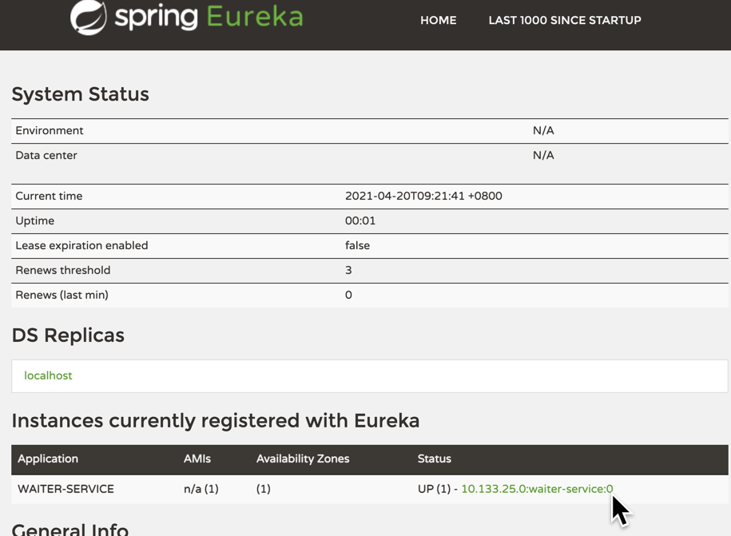

# 服务注册、发现Demo
这个例子演示了使用Erueka 作为服务发现的服务器，将waiter-servier注册上去

## Euraka Server

### POM 加上Euraka Server的依赖。
```xml
<dependency>
    <groupId>org.springframework.boot</groupId>
    <artifactId>spring-boot-starter-web</artifactId>
</dependency>
<dependency>
    <groupId>org.springframework.cloud</groupId>
    <artifactId>spring-cloud-starter-netflix-eureka-server</artifactId>
</dependency>
```

### 配置
主类上加上 `@EnableEurekaServer` 

配置文件配置如下
```properties
server.port=8761

#Eureka 服务自己不需要注册了
eureka.client.register-with-eureka=false
#也不去获取注册的服务
eureka.client.fetch-registry=false
```
#### 运行
启动这个服务

## waiter-server

### POM 配置
加上spring cloud 的 dependencyManagement 和 eureka-client dependency
```xml
<spring-cloud.version>2020.0.2</spring-cloud.version>
<!--要在 properties 中加上 spring cloud version-->

<dependencyManagement>
    <dependencies>
        <dependency>
            <groupId>org.springframework.cloud</groupId>
            <artifactId>spring-cloud-dependencies</artifactId>
            <version>${spring-cloud.version}</version>
            <type>pom</type>
            <scope>import</scope>
        </dependency>
    </dependencies>
</dependencyManagement>

<dependency>
    <groupId>org.springframework.cloud</groupId>
    <artifactId>spring-cloud-starter-netflix-eureka-client</artifactId>
</dependency>
```

#### 配置
主类加上 `@EnableDiscoveryClient`

~~增加一个 bootstrap.properties, 加上配置（在spring cloud 2020.0。2中不用加这个文件了~~ 
这是一个碰到的坑，在spring cloud 2020.0.2 中直接加载`application.properties`中就好了。

在 `application.properties` 中加上
`spring.application.name=waiter-service`
这个就是服务在注册中心的名字

`application.properties` 中将`servier.port` 设为0，表示将随机选择一个端口
注册中心的地址暂时先不用配，使用默认`localhost:8761`就可以

#### 运行
先启动 `eureka-server`， 再启动` waiter-servie`

打开 `http://localhost:8761/` 就可以看到`Eureka`的界面。上面看到有一个服务已经注册上去了。

然后运行 `waiter-service` 就可以看到 在`euraka` 界面看到了一个注册上去的服务。  

> 试了一下多启动几个相同的服务，不过目前发现eureka 相同名字的服务只有一个，最新的会把原有的踢掉
>

## Customer Service
创建一个Customer的项目
也要依赖
`Discovery-Client`
并且作为一个`spring-boot-web`项目

### restTempate的方式
#### pom 配置
由于将底层换为HttpClient，所以要加上依赖
```xml
<dependency>
    <groupId>org.apache.httpcomponents</groupId>
    <artifactId>httpclient</artifactId>
    <version>4.5.7</version>
</dependency>
```
#### 配置RestTemplate
由于之前的课说过，RestTempate没有自动配置，所以需要手动创建一个。
并且由于要用到Load balance所以标注为 `@Loadbalanced` (如果没有这个标注，用服务名访问会显示找不到)
```java
@LoadBalanced
@Bean
public RestTemplate restTemplate(RestTemplateBuilder builder) {
    return builder
            .build();
}
```
当然，这边可以将RestTemplate底层换为HTTPClient，并且设置连接池，这个放到附录中。

#### 然后就可以调用远程服务了
注意看，通过discoveryClient 可以获得远程服务的Server list  
用restTemplate + 服务名就可以请求了
```java
@Autowired
RestTemplate restTemplate;

@Autowired
DiscoveryClient discoveryClient;

@Override public void run(ApplicationArguments args) throws Exception {

    discoveryClient.getInstances("waiter-service")
            .forEach(s -> log.info("waiter service: hots {} port {}", s.getHost(), s.getPort()));
    getMenu();
}

void getMenu() {
    ParameterizedTypeReference<List<Coffee>> cls = new ParameterizedTypeReference<List<Coffee>>() {
    };

    ResponseEntity<List<Coffee>>
            list = restTemplate.exchange("http://waiter-service/coffee/all", HttpMethod.GET, null, cls);
    list.getBody().forEach(coffee -> log.info("{}", coffee));

}
```

### Feign Client
#### 加上Feigh Client 的 POM依赖
```xml
<dependency>
    <groupId>org.springframework.cloud</groupId>
    <artifactId>spring-cloud-starter-openfeign</artifactId>
</dependency>
<dependency>
    <groupId>io.github.openfeign</groupId>
    <artifactId>feign-httpclient</artifactId>
</dependency>
```
> feign **不需要**再加上如下所示的http的依赖
```xml
<dependency>
    <groupId>org.apache.httpcomponents</groupId>
    <artifactId>httpclient</artifactId>
    <version>4.5.7</version>
</dependency>
```
#### 写Feign Client的相关接口
写得和Controller 很像，定义服务名，parent path等。

每个方法都是一个远端调用，要写清楚 path
```java
@FeignClient(name="waiter-service", contextId = "coffee", path = "/coffee")
public interface CoffeeService {

    @GetMapping(path="/all")
    List<Coffee> getAll();
}
```
注意如果有两个以上的接口标记为 `@FeignClient` 如果不设`contenxtId` 就会出现下面问题
>The bean 'waiter-service.FeignClientSpecification' could not be registered. A bean with that name has already been defined and overriding is disabled.


#### Applicaiton类加上 @EnableFeignClient
>注意：这在做的时候犯了错，没加上去，结果显示@Autowire 找不到Bean

>注意2：还是需要 `@EnableDiscoveryClient` 标准的。
#### 调用
Feign Client的调用比 ResetTemplate 简单多了，就像调用Service方法一样。
```java
void getMenuWithFeigh() {
    List<Coffee> coffees = coffeeService.getAll();
    coffees.forEach(c -> log.info("{}", c));
}
```


## 附录1 定制化httpTemplate

### 首先加上HTTPClient的依赖
```xml
<dependency>
    <groupId>org.apache.httpcomponents</groupId>
    <artifactId>httpclient</artifactId>
    <version>4.5.7</version>
</dependency>
```
然后创建`requestFactory` 并且将r`equestFactor`设置到 `resttempalte`中。
```java
@Bean
public HttpComponentsClientHttpRequestFactory requestFactory() {

    PoolingHttpClientConnectionManager connectionManager = new PoolingHttpClientConnectionManager();

    CloseableHttpClient httpClient = HttpClients.custom()
            .setConnectionManager(connectionManager)
            .build();

    HttpComponentsClientHttpRequestFactory requestFactory = new HttpComponentsClientHttpRequestFactory(httpClient);

    return requestFactory;
}

@LoadBalanced
@Bean
public RestTemplate restTemplate(RestTemplateBuilder builder) {
    return builder
            .setConnectTimeout(Duration.ofMillis(100))
            .setReadTimeout(Duration.ofMillis(500))
            .requestFactory(this::requestFactory)
            .build();
}
```
这是一个比较简单的版本，还可以针对各种策略进行定制，比如keep-alive, 最大连接数等。这个等后面研究吧。
下面是一个自定义更多配置的版本，都有注释，一看就明白
```java
@Bean
public HttpComponentsClientHttpRequestFactory requestFactory() {

    PoolingHttpClientConnectionManager connectionManager =
            new PoolingHttpClientConnectionManager(30, TimeUnit.SECONDS);
    // 设置 timeToLive 为 30 秒

    connectionManager.setMaxTotal(200); //最大连接数
    connectionManager.setDefaultMaxPerRoute(20); //每个主机地址的最大连接数

    CloseableHttpClient httpClient = HttpClients.custom()
            .setConnectionManager(connectionManager)
            .evictIdleConnections(30, TimeUnit.SECONDS)//idel 连接30秒后会关掉
            .disableAutomaticRetries() //关闭自动重试
            // 有 Keep-Alive 认里面的值，没有的话永久有效
            //.setKeepAliveStrategy(DefaultConnectionKeepAliveStrategy.INSTANCE)
            // 换成自定义的
            .setKeepAliveStrategy(new CustomConnectionKeepAliveStrategy())//设置为自定义KeepAlive策略，设了一个默认的keep-alive
            .build();

    HttpComponentsClientHttpRequestFactory requestFactory = new HttpComponentsClientHttpRequestFactory(httpClient);

    return requestFactory;
}

@LoadBalanced
@Bean
public RestTemplate restTemplate(RestTemplateBuilder builder) {
    return builder
            .setConnectTimeout(Duration.ofMillis(100))
            .setReadTimeout(Duration.ofMillis(500))
            .requestFactory(this::requestFactory)
            .build();
}
```

## 附录2 Consul作为服务发现
### 依赖配置
Consul作为服务发现的话，改动不大，POM 由`Eureka Client` 改为 `Consul discovery`
```xml
<!--		<dependency>-->
<!--			<groupId>org.springframework.cloud</groupId>-->
<!--			<artifactId>spring-cloud-starter-netflix-eureka-client</artifactId>-->
<!--		</dependency>-->
<dependency>
    <groupId>org.springframework.cloud</groupId>
    <artifactId>spring-cloud-starter-consul-discovery</artifactId>
</dependency>
```

### 加上Consul配置
```properties
# Consul 服务注册发现相关配置
spring.cloud.consul.port=8500
spring.cloud.consul.host=localhost
spring.cloud.consul.discovery.prefer-ip-address=true
```

### 通过Docker 启动Consul服务
```shell
docker run --name consul -d -p 8500:8500 -p 8600:8600/udp consul
```
打开 `localhost:8500` 就能看到consul的控制台

### 启动  
其他都不用改。启动 `waiter service` 和 `customer service` 应该就能正常工作了

对了，不需要再启动`Eureka Server`了

## 附录3 Zookeeper作为服务发现
### 依赖配置
Consul作为服务发现的话，改动不大，POM 由`Eureka Client` 改为 `Consul discovery`
```xml
<!--		<dependency>-->
<!--			<groupId>org.springframework.cloud</groupId>-->
<!--			<artifactId>spring-cloud-starter-netflix-eureka-client</artifactId>-->
<!--		</dependency>-->
<dependency>
    <groupId>org.springframework.cloud</groupId>
    <artifactId>spring-cloud-starter-zookeeper-discovery</artifactId>
</dependency>
```

### 加上Consul配置
```properties
#Zookeeper 服务注册相关配置
spring.cloud.zookeeper.connect-string=localhost:2181
```

### 通过Docker 启动Consul服务
```shell
docker run --name zookeeper -p 2181:2181 -d zookeeper:3.5
```
相关命令
```shell
# 登陆进去
docker exec -it zookeeper bash

#登进去之后 进入bin，执行
zkCli.sh #连接到zk

#看到目录里的列表
ls / 
>> [services, zookeeper]

#继续执行 
ls /services/waiter-service
#可以看到节点的详细信息

ls /services/waiter-service/b1fdcb1e-27a8-4409-a703-3458260c450a
>>[]
#说明是一个叶子节点

get /services/waiter-service/b1fdcb1e-27a8-4409-a703-3458260c450a
>>{"name":"waiter-service","id":"b1fdcb1e-27a8-4409-a703-3458260c450a","address":"10.133.11.150","port":53598,"sslPort":null,"payload":{"@class":"org.springframework.cloud.zookeeper.discovery.ZookeeperInstance","id":"waiter-service","name":"waiter-service","metadata":{"instance_status":"UP"}},"registrationTimeUTC":1618899361271,"serviceType":"DYNAMIC","uriSpec":{"parts":[{"value":"scheme","variable":true},{"value":"://","variable":false},{"value":"address","variable":true},{"value":":","variable":false},{"value":"port","variable":true}]}}
```

### 启动
其他都不用改。启动 `waiter service` 和 `customer service` 应该就能正常工作了

对了，不需要再启动`Eureka Server`了
