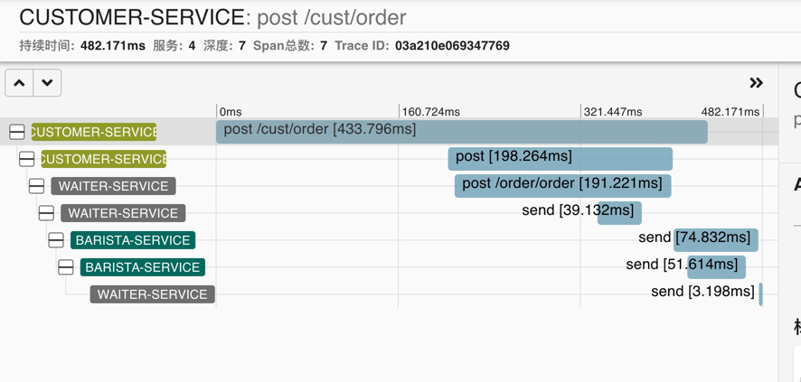

# 服务链路跟踪
本`Demo`演示了如何使用`Zipkin`来进行服务链路的跟踪
本`Demo` 有三个服务，`customer`, `waiter`, `barista`
`customer` 会下单给 `waiter`， `waiter` 会下单并且给b`arista`发送`neworder`的消息，`barista`收到消息后，做好咖啡后会发送消息给waiter告知咖啡已经做好

使用zipkin做服务跟踪调用
## POM
在三个服务中加上 ZIPKIN 的依赖
```xml
<dependency>
   <groupId>org.springframework.cloud</groupId>
   <artifactId>spring-cloud-starter-zipkin</artifactId>
   <version>2.2.8.RELEASE</version>
</dependency>
```
## 配置
在三个服务中加上 ZIPKIN的配置
```properties
# Trace
spring.zipkin.base-url=http://localhost:9411
spring.sleuth.sampler.probability=1.0
spring.zipkin.sender.type=web
```

## 运行
使用Docker启动 zipkin
```shell
docker run --name zipkin -d -p 9411:9411 openzipkin/zipkin
```

三个服务运行起来之后，调用customer的接口

```shell
ab -c 1 -n 1 -p /Users/admin/test/ab_post_data -T "application/json" http://localhost:8080/cust/order
```
就可以在 zipkin 的页面看到trace了
